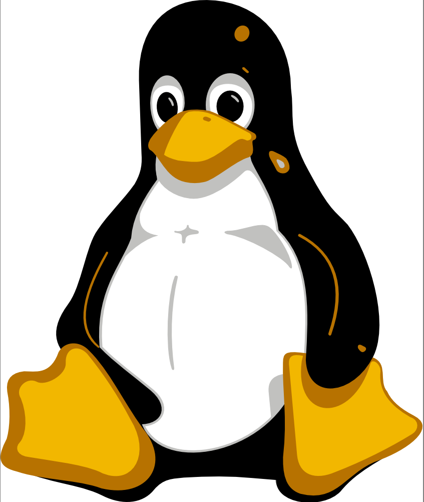

# Markdown Test Document

Markdown is a lightweight markup language with plain text formatting syntax. Its design allows it to be converted to many formats, but it's primarily used for formatting readme files, writing messages in online discussion forums, and creating rich text using a plain text editor.

## Links

Here are some examples of links:

- [U++](https://www.ultimatepp.org)
- [Markdown Guide](https://www.markdownguide.org)

## Images

You can embed images:



## Lists

### Unordered List
- Item 1
- Item 2
  - Subitem 2.1
  - Subitem 2.2
- Item 3

### Ordered List
1. First item
2. Second item
3. Third item

## Code Blocks

You can include code blocks:

```C++
int main()
{
    printf("Hello, world!");
}
```


